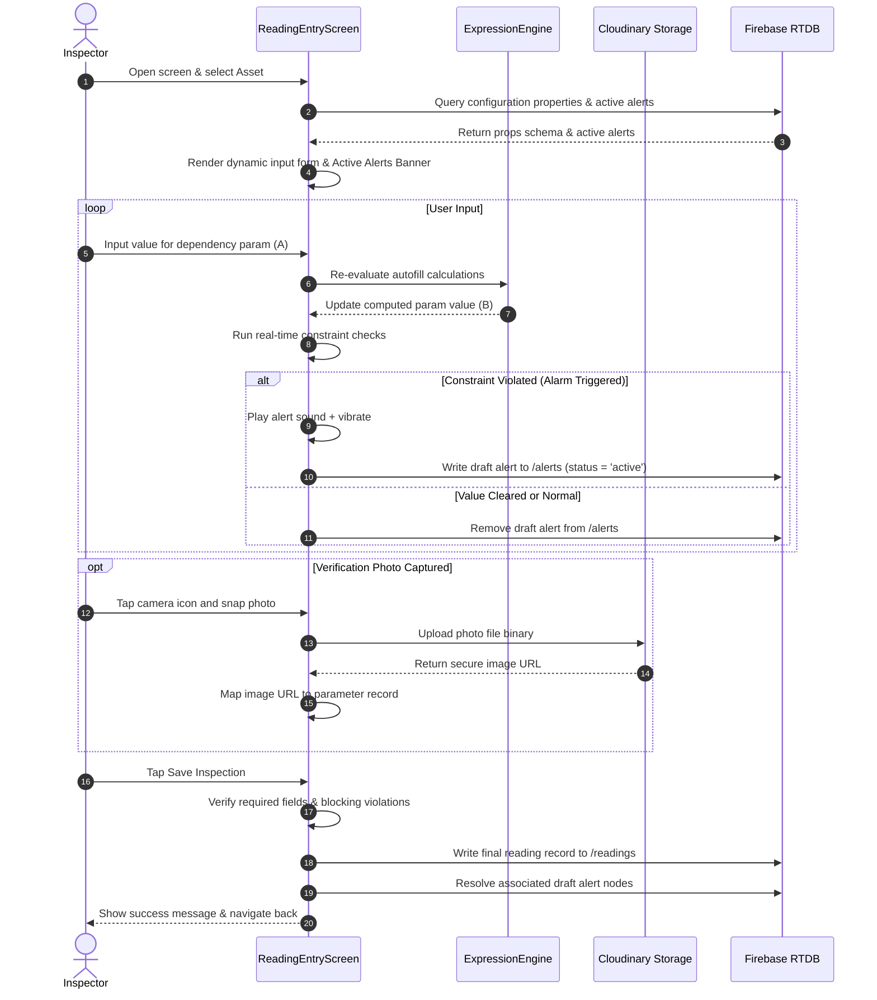
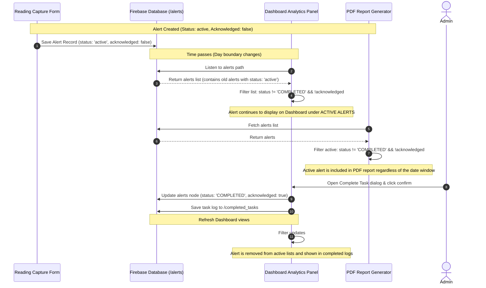

# Core System Architecture & Screen Specification (Spec.md)

This document provides a detailed specification of the screens, services, data models, and backend flows in the **VAPLI (Lubrication Monitor)** Flutter application.

---

## Table of Contents
1. [Core Services & Global Configurations](#1-core-services--global-configurations)
2. [Screen-by-Screen Specifications](#2-screen-by-screen-specifications)
   - [Authentication Flow (`LoginScreen`)](#authentication-flow-loginscreen)
   - [Client & Tenant Selector (`ClientSelectorPage`)](#client--tenant-selector-clientselectorpage)
   - [Application Shell & Navigation (`HomeScreen`)](#application-shell--navigation-homescreen)
   - [Asset/Tank Tree Browser (`TankBrowserScreen`)](#assettank-tree-browser-tankbrowserscreen)
   - [Tank Input Browser (`TankInputBrowser`)](#tank-input-browser-tankinputbrowser)
   - [Inspection Parameter Config Builder (`PropertyBuilderPage`)](#inspection-parameter-config-builder-propertybuilderpage)
   - [Inspection Entry & Reading Form (`ReadingEntryScreen`)](#inspection-entry--reading-form-readingentryscreen)
   - [Visual Hotspot Verification (`ImageMarkerScreen`)](#visual-hotspot-verification-imagemarkerscreen)
   - [Dashboard Analytics Hub (`DashboardTab`)](#dashboard-analytics-hub-dashboardtab)
   - [Trends & Historical Reports Screen (`TrendsScreen`)](#trends--historical-reports-screen-trendsscreen)
   - [System Admin Operations (`AdminDashboard`)](#system-admin-operations-admindashboard)
3. [Key Application Workflows](#3-key-application-workflows)
   - [Inspection Entry & Validation Flow](#inspection-entry--validation-flow)
   - [Alert Lifecycle & Persistence Flow](#alert-lifecycle--persistence-flow)
   - [PDF & Excel Report Generation Engine](#pdf--excel-report-generation-engine)
4. [Database Schema Mapping (Firebase Realtime Database)](#4-database-schema-mapping-firebase-realtime-database)

---

## 1. Core Services & Global Configurations

### 1.1 Database Mode Service (`DatabaseModeService`)
* **File Location**: [database_mode_service.dart](file:///c:/Users/muthu/Freelance/vapli/lib/core/services/database_mode_service.dart)
* **Purpose**: Coordinates access to the database by routing queries based on system state.
* **How it works**:
  * **Development / Sandbox Mode**: Controlled by a `ValueNotifier<bool> isDevelopment`. When active, database queries prefix their paths with `testDB/` (e.g. `testDB/tanks` instead of `tanks`). This isolates test modifications from the main cloud environment.
  * **Tenant Scope Segmentation**: Controlled by `ValueNotifier<String?> activeClientId`. If set and a path belongs to `_scopedPaths` (like `tanks`, `readings`, `alerts`, `completed_tasks`), the path is automatically prefixed with the active client ID (e.g., `client_123/tanks`). This secures data sharing under a multi-tenant client structure.
  * **Path Resolution**: The `path(String rawPath)` function dynamically normalizes and constructs the full target database reference.

### 1.2 Access Control Service (`AccessControlService`)
* **File Location**: [access_control_service.dart](file:///c:/Users/muthu/Freelance/vapli/lib/core/services/access_control_service.dart)
* **Purpose**: Enforces Role-Based Access Control (RBAC) across screens and operations.
* **Roles**: `super admin`, `client admin`, `inspector`, and `guest`.
* **How it works**:
  * Holds specific privilege strings like `manage_users`, `edit_tanks`, `capture_readings`, `view_audit_logs`.
  * Generates default privileges maps for roles and performs checks such as `hasPrivilege(UserModel user, String privilege)` before allowing navigation or actions.

### 1.3 Expression Engine (`ExpressionEngine`)
* **File Location**: [expression_engine.dart](file:///c:/Users/muthu/Freelance/vapli/lib/core/services/expression_engine.dart)
* **Purpose**: Parses and evaluates mathematical expressions containing parameter references. Used for automated parameter calculations.
* **How it works**:
  * **Variable Extraction**: `extractIds(String expression)` finds param IDs enclosed in curly brackets (e.g., `${temp_a}` extraction yields `temp_a`).
  * **Parsing & Evaluation**: Resolves formula values by replacing variable markers with actual numeric values from the current reading, parsing the expression into an Abstract Syntax Tree (AST), and executing operations (`+`, `-`, `*`, `/`) with division-by-zero protection.

### 1.4 Audit Log Service (`AuditLogService`)
* **File Location**: [audit_log_service.dart](file:///c:/Users/muthu/Freelance/vapli/lib/core/services/audit_log_service.dart)
* **Purpose**: Records inspector and administrator actions for security verification and reporting.
* **How it works**:
  * Logs actions like `export_report`, `user_login`, `alert_resolved`, `tank_created`.
  * Appends entries containing timestamps, user details, action codes, and parameter details to `/admin_audit_logs` in the database.

---

## 2. Screen-by-Screen Specifications

### Authentication Flow (`LoginScreen`)
* **File Location**: [login_screen.dart](file:///c:/Users/muthu/Freelance/vapli/lib/features/auth/presentation/pages/login_screen.dart)
* **What it does**: Handles system login using username and password matching against encrypted Firebase credentials.
* **How it works**:
  * Queries `testDB/users` or `/users` to retrieve username matches.
  * Hashes the entered password using SHA-256 and compares it to the database `password_hash`.
  * **Session Persistence**: Writes active user credentials to `SharedPreferences` via `SessionManager`. Configures a customizable timeout window (defaulting to 1 hour or continuous depending on client setup).

### Client & Tenant Selector (`ClientSelectorPage`)
* **File Location**: [client_selector_page.dart](file:///c:/Users/muthu/Freelance/vapli/lib/features/home/presentation/pages/client_selector_page.dart)
* **What it does**: Allows super admins or multi-client users to select their active client scope and toggle development database sandboxes.
* **How it works**:
  * Retrieves all client entries from `/clients`.
  * Updates `DatabaseModeService.activeClientId` and saves the selected scope to `SharedPreferences`.
  * Triggers database path re-routing across all screens upon selection.

### Application Shell & Navigation (`HomeScreen`)
* **File Location**: [home_screen.dart](file:///c:/Users/muthu/Freelance/vapli/lib/features/home/presentation/pages/home_screen.dart)
* **What it does**: Coordinates primary navigation via a bottom navigation bar and drawer menu.
* **Tab Navigation Options**:
  * **Dashboard**: Statistics and active alerts list.
  * **Browse**: Hierarchy browser for assets and tank groups.
  * **Trends**: Historical graphs and analysis list.
  * **Scanner**: Floating shortcut that triggers QR/barcode camera scanners.
* **Additional Details**:
  * Shows active developer/sandbox flags and client scopes in the app header.
  * Integrates drawer-based routing to admin control panels (e.g. Audit Logs, User Management).

### Asset/Tank Tree Browser (`TankBrowserScreen`)
* **File Locations**: [tank_browser_screen.dart](file:///c:/Users/muthu/Freelance/vapli/lib/features/tanks/presentation/pages/tank_browser_screen.dart) & [tank_browser_screen_state.dart](file:///c:/Users/muthu/Freelance/vapli/lib/features/tanks/presentation/pages/tank_browser_screen_state.dart)
* **What it does**: Displays folders and asset hierarchies in a nested tree structure.
* **How it works**:
  * Queries `/tank_tree` to fetch list items.
  * Dynamically groups list elements based on their `parentId` references to render folders and leaf assets (Tanks, Gearboxes, etc.).
  * **Actions Menu**:
    * Clicking a folder expands/collapses its child assets.
    * Clicking a leaf asset shows options: **Capture Reading** (opens reading entry), **Property Builder** (configure inspection parameters), or **Delete Asset**.

### Tank Input Browser (`TankInputBrowser`)
* **File Location**: [tank_input_browser.dart](file:///c:/Users/muthu/Freelance/vapli/lib/features/home/presentation/pages/tank_input_browser.dart)
* **What it does**: Provides a folder-browser interface for operators to search/scan tanks and see details before taking a reading.
* **How it works**:
  * **Breadcrumb Navigation**: Shows folder hierarchies in Windows-style paths. Tapping path nodes drills down or navigates up.
  * **QR / Barcode Search**: Tapping the scanner button resolves a scanned tank ID and automatically navigates the tree to select the tank leaf node.
  * **Leaf Detail Page**: Shows tank metadata, a "Take Reading" button, and an active alerts banner if the tank has open alerts.
  * **Active Alert Warnings**: Real-time Firebase streams check for active alerts when selecting a tank leaf. If alerts exist, triggers a default sound (`assets/sounds/alert.mp3` or system beep) and heavy haptic vibration, displaying a non-dismissible warning popup.
  * **Skip Tank (Sequential Auto-Routing)**: In the warning popup, if the operator selects "No, Skip Tank", the app automatically routes the inspector to the next sibling tank in the folder sequence. If it is the last tank in the folder, the selection is cleared.

### Inspection Parameter Config Builder (`PropertyBuilderPage`)
* **File Locations**: [property_builder_page.dart](file:///c:/Users/muthu/Freelance/vapli/lib/features/tanks/presentation/pages/property_builder_page.dart) & [property_builder_page_state.dart](file:///c:/Users/muthu/Freelance/vapli/lib/features/tanks/presentation/pages/property_builder_page_state.dart)
* **What it does**: Configures the inspection checklist, constraints, rules, and calculations for a specific asset.
* **How it works**:
  * Configures parameter properties such as ID, label, input field type (`number`, `text`, `dropdown`, `slider`, `group`, `dual_text`), and mandatory flags.
  * **Constraint Editor**: Set limits (e.g., `<= 75.0` or `contains "Normal"`) and configure alert behaviors:
    * **Severity**: `warning`, `critical`, or `info`.
    * **Alarm Actions**: Sound alarm toggle, dashboard warning trigger, and photo capture requirement.
    * **Blocking**: Prevent submission if the constraint is violated.
    * **History**: Record violation in persistent database tables.
  * **Calculation Rules**: Formulates calculations using `{param_id}` variables. Mark fields as read-only to dynamically evaluate their contents via the `ExpressionEngine`.

### Inspection Entry & Reading Form (`ReadingEntryScreen`)
* **File Locations**: [reading_entry_screen.dart](file:///c:/Users/muthu/Freelance/vapli/lib/features/readings/presentation/pages/reading_entry_screen.dart) & [reading_entry_state.dart](file:///c:/Users/muthu/Freelance/vapli/lib/features/readings/presentation/pages/reading_entry_state.dart)
* **What it does**: The interface where inspectors record values, capture verification photos, and submit readings.
* **How it works**:
  * Displays input fields based on the asset's configured inspection parameters.
  * **Duplicate Reading Check**: Checks on initialization if a reading exists in the last 30 minutes. If found, displays a YES/NO confirmation popup. Selecting NO cancels reading capture (closes screen). Selecting YES prompts for a mandatory reason, validated to be non-empty, which is then stored under `duplicate_reason` in the reading's `inspectionValues`.
  * **Historical Upload Override**: If the active user has the `historical_upload` privilege, they can tap on the Capture Start Date and Capture End Date in the metadata card to edit them using date and time pickers, overriding the default timestamps.
  * **Autofill Calculations**: Real-time evaluation of calculated fields when dependencies change.
  * **Immediate Photo Upload**: Camera photos are uploaded directly to Cloudinary, returning image URLs to state variables immediately.
  * **Active Alerts Banner**: A banner displays at the top of the form, showing unresolved alerts associated with the asset.
  * **Real-time Violation Checks**: Compares entered values against constraints in real time. If a violation is found:
    * Plays warning sounds and triggers haptic vibrations.
    * Dynamically creates a draft alert node in `/alerts/` and `/violations/`.
    * If the violation is resolved, the draft node is automatically removed.
  * **Folder-Sequenced Navigation**: If accessed via the asset tree/folder browser, the screen receives a list of sibling tanks in that folder. On saving:
    * Displays a success state and waits 3 seconds.
    * Pops back to `TankInputBrowser` with a payload requesting to select the next leaf detail view so the inspector can verify info before taking a reading.
    * If it is the final tank in the folder, pops back requesting to clear selection. // 🔖 Added for Reading Capture Flow Refactor

### Visual Hotspot Verification (`ImageMarkerScreen`)
* **File Location**: [image_marker_screen.dart](file:///c:/Users/muthu/Freelance/vapli/lib/features/readings/presentation/pages/image_marker_screen.dart)
* **What it does**: Enables marker placement on uploaded asset images.
* **How it works**:
  * Opens an image inside a coordinate system wrapper.
  * Allows inspectors to tap coordinates on the image to place markers representing inspection points.
  * Saves coordinates as proportional values (`dx` and `dy` scales) to map markers consistently across various screen resolutions.

### Dashboard Analytics Hub (`DashboardTab`)
* **File Locations**: [dashboard_tab.dart](file:///c:/Users/muthu/Freelance/vapli/lib/features/dashboard/presentation/pages/dashboard_tab.dart) & [dashboard_tab_state.dart](file:///c:/Users/muthu/Freelance/vapli/lib/features/dashboard/presentation/pages/dashboard_tab_state.dart)
* **What it does**: Displays system metrics, active alerts, and report options.
* **Key Components**:
  * **Analytics Cards**: Real-time counts of completed inspections, pending actions, open alerts, and task completion percentages.
  * **Active Alerts Panel**: Lists all active alerts (`!resolved && status != 'COMPLETED'`) across all assets.
  * **Resolve Task Dialog**: Allows admins to review alerts and mark them as resolved. This writes a completed log entry and updates the database alert status to `COMPLETED`.
  * **Report Exports**: Downloads inspection summary PDFs, abnormality Excel sheets, and alerts lists.

### Trends & Historical Reports Screen (`TrendsScreen`)
* **File Locations**: [trends_screen.dart](file:///c:/Users/muthu/Freelance/vapli/lib/features/reports/presentation/pages/trends_screen.dart) & [trends_screen_state.dart](file:///c:/Users/muthu/Freelance/vapli/lib/features/reports/presentation/pages/trends_screen_state.dart)
* **What it does**: Renders historical graphs and displays system logs.
* **Key Components**:
  * **Trends Graph**: Renders line charts of parameter values over time, including threshold lines for constraints.
  * **Historical Log Table**: Lists past readings and alerts with details on inspectors, captured values, and status mappings.

### System Admin Operations (`AdminDashboard`)
* **File Locations**: [admin_dashboard.dart](file:///c:/Users/muthu/Freelance/vapli/lib/features/admin/presentation/pages/admin_dashboard.dart), [admin_audit_logs_page.dart](file:///c:/Users/muthu/Freelance/vapli/lib/features/admin/presentation/pages/admin_audit_logs_page.dart) & [admin_settings_page.dart](file:///c:/Users/muthu/Freelance/vapli/lib/features/admin/presentation/pages/admin_settings_page.dart)
* **What it does**: Enables administrative controls over users, assets, audits, and settings.
* **Key Components**:
  * **User Management**: Onboards users, assigns roles (`super admin`, `client admin`, `inspector`), and sets tenant restrictions.
  * **Audit Log Viewer**: Displays system audit records with search and filter functionality.
  * **System Settings**: Configures application timeout settings, theme variables, and client configurations.

---

## 3. Key Application Workflows

### Inspection Entry & Validation Flow



### Alert Lifecycle & Persistence Flow



### PDF & Excel Report Generation Engine
* **Executive Summary PDF Report**:
  * Fetches folder hierarchy data to group assets dynamically.
  * Outputs assets as rows and parameters as columns on separate pages for each folder.
  * Compares inspection averages against expected parameters and draws upward/downward trend arrows.
  * Integrates captured verification images as clickable blue links.
* **Abnormality Excel Report**:
  * Creates spreadsheet tabs named after folders (limited to 31 characters).
  * Lists out-of-bounds parameter logs, image links, and inspection duplicate reasons in a rotated row/column grid.
* **Inspection Report PDF**:
  * Generated in Portrait layout (A4 format).
  * **Page 1 (Summary Cover)**: Displays report range, compliance rates, folder structure, operating ranges, and latest captured inspections. Metric count values are formatted as blue underlined hyperlinks that navigate directly to target sections.
  * **Asset Inspection Detailed List (Page 2 onwards)**: A unified, folder-sequenced table of all tanks (both inspected and pending). Assets are grouped by folder alphabetically, and sorted by name. Pending inspection rows are highlighted in light cyan-blue.
  * **Active Unresolved Alerts (Final Page)**: Appends a list of open unresolved alerts at the end of the report.

---

## 4. Database Schema Mapping (Firebase Realtime Database)

### 4.1 Users (`/users/{userId}`)
```json
{
  "id": "1778303550928-4e2cb223",
  "username": "admin",
  "full_name": "System Administrator",
  "password_hash": "7d20f317b9e34c36747cf8275645ab8fe145e29b...",
  "role": "super admin",
  "is_active": true,
  "created_at": "2026-05-09T05:12:30.942719",
  "last_login_at": "2026-05-22T14:28:27.636841",
  "privileges": {
    "manage_users": true,
    "edit_tanks": true,
    "capture_readings": true
  }
}
```

### 4.2 Assets / Tanks (`/tanks/{tankId}`)
```json
{
  "id": "tank_1122",
  "tankCode": "TNK-09",
  "tankName": "Turbine Lubricant Tank A",
  "location": "PM3 Zone 1",
  "created_at": "2026-05-15T08:00:00Z",
  "inspectionProperties": [
    {
      "id": "temp_sensor",
      "label": "Operating Temperature",
      "type": "number",
      "required": true,
      "constraints": [
        {
          "id": "c_temp_high",
          "op": ">",
          "value": "80",
          "severity": "critical",
          "alert_title": "High Temperature Alarm",
          "message": "Temperature exceeded normal limits",
          "show_dashboard_alert": true,
          "play_sound_on_violation": true,
          "capture_image_on_violation": true,
          "block_submission": false,
          "store_history": true
        }
      ]
    }
  ]
}
```

### 4.3 Active Alerts (`/alerts/{alertId}`)
```json
{
  "id": "live_tank_1122_temp_sensor_c_temp_high",
  "tank_id": "tank_1122",
  "tank_code": "TNK-09",
  "tank_name": "Turbine Lubricant Tank A",
  "constraint_id": "c_temp_high",
  "alert_title": "High Temperature Alarm",
  "message": "Operating Temperature must be less than 80 (recorded: 85.4)",
  "severity": "critical",
  "param_id": "temp_sensor",
  "param_label": "Operating Temperature",
  "param_value": "85.4",
  "captured_by": "inspector_456",
  "captured_by_name": "John Doe",
  "image_url": "https://res.cloudinary.com/.../image.jpg",
  "timestamp": "2026-06-07T10:15:30Z",
  "acknowledged": false,
  "live": true,
  "status": "active"
}
```

### 4.4 Completed Tasks Log (`/completed_tasks/{taskId}`)
```json
{
  "alert_id": "live_tank_1122_temp_sensor_c_temp_high",
  "completed_at": "2026-06-07T10:30:15Z",
  "completed_by": "System Administrator",
  "alert": {
    "id": "live_tank_1122_temp_sensor_c_temp_high",
    "alert_title": "High Temperature Alarm",
    "message": "Operating Temperature must be less than 80 (recorded: 85.4)",
    "severity": "critical",
    "tank_id": "tank_1122",
    "tank_name": "Turbine Lubricant Tank A",
    "tank_code": "TNK-09",
    "param_id": "temp_sensor",
    "param_label": "Operating Temperature",
    "param_value": "85.4",
    "captured_by": "inspector_456",
    "captured_by_name": "John Doe",
    "image_url": "https://res.cloudinary.com/.../image.jpg",
    "timestamp": "2026-06-07T10:15:30Z",
    "acknowledged": true,
    "live": true,
    "status": "COMPLETED"
  }
}
```

### 4.5 Readings Log (`/readings/{readingId}`)
```json
{
  "id": "read_8899_abcd",
  "tankId": "tank_1122",
  "tankCode": "TNK-09",
  "tankName": "Turbine Lubricant Tank A",
  "capturedBy": "inspector_456",
  "capturedByName": "John Doe",
  "capturedAt": "2026-06-07T10:20:00Z",
  "values": {
    "temp_sensor": "78.2",
    "oil_level": "Normal"
  },
  "images": {
    "temp_sensor": "https://res.cloudinary.com/.../temp.jpg"
  },
  "duplicateReason": ""
}
```
